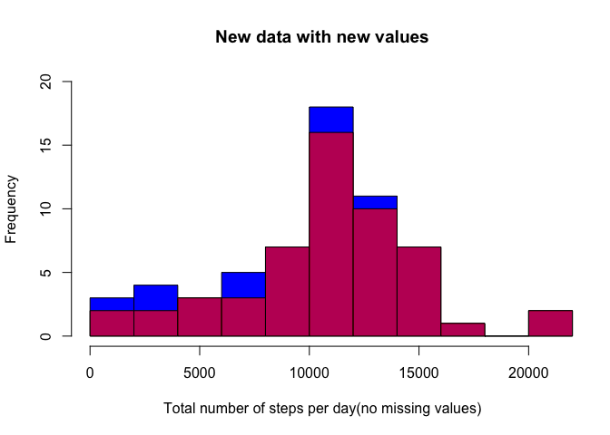
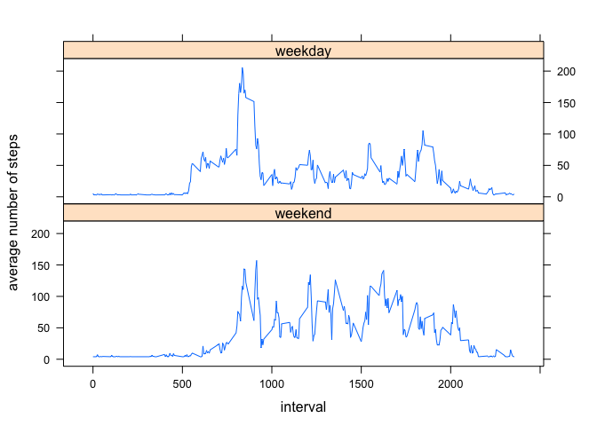

# Reproducible Research: Peer Assessment 1


## Loading and preprocessing the data
After unzip activity.zip to activity.csv in same working directory, the git repository. Data from activity.csv is generated by personal activity monitor device.
Loading activity.csv by:

```r
data<-read.csv("activity.csv")
```
The checking dimensions of _data_ shows that there are three variables: _steps_, _date_ and _interval_. Total observations from each interval of five minutes during two months is 17,568 (= 30+31 days\*24 hours\*(60 minutes/5 minutes). It is confirmed by:

```r
dim(data)
```

```
## [1] 17568     3
```
_data_ is preprocessing as following:
There are missing observations. _dataNM_ is created from _data_ by omitting row with NA:


```r
dataNM<-na.omit(data)
```
The column steps from _data_ is stored in dataset _steps_. So same way for column _interval_ from _data_.

dataset _steps_ are total amount of steps taken in a 5 minutes interval as integer. A value from _interval_ is noted as 'HM', where H is number hour from 00:00 and M is multiple of 5 minutes. For example the interval labeled with 2355 means 5 minutes interval from 23:55h. In other words, it is interval between 23:55 and 00:00. So notice there is the total 288 intervals per day. 
The class of column _date_ is converting into class Date before storing into dataset _date_:

```r
dataNM$date<-as.Date(as.character(dataNM$date),format="%Y-%m-%d");
date<-dataNM$date
```


## What is mean total number of steps taken per day?

We take column _steps_ and group rows by days. For each group, the number of steps are to add up by function _sum()_. So total number of steps per day is calculated by:

```r
tpd<-aggregate(steps,list(date),sum)
```
The dataset _tpd_ contains values of total number of steps per day. 
The dataset _sumstep_ is the column of total number of steps from _tpd_:

```r
sumsteps<-tpd[,2]
```
The result is viewed at the next histogram:

```r
hist(
     sumsteps, 
     xlab="Total number of steps per day",
     main="",
     breaks=10
     )
```

 

The average of total number of steps per day is:

```r
mean(sumsteps)
```

```
## [1] 10766
```
And the median of total number of steps per day is:

```r
median(sumsteps)
```

```
## [1] 10765
```

## What is the average daily activity pattern?

The plot of 5 minute interval as variable for x-axis and the average number of steps taken averaged across all days as variable for y-axis has  got dataset _asi_, obtained from the following calculation:


```r
asi<-aggregate(steps~interval,list(interval),mean)
```
The dataset _asi_ have got two sorts of values, the average of numbers of steps per interval.
The plot is shown:

```r
plot(asi, type='l', ylab="average number of steps", xlab="interval")
```

 

To find an interval which the number of steps is maximum, firstly we create dataset _msi_ almost same way as last time, but then with function _max()_ instead of _mean()_:

```r
msi<-aggregate(steps~interval,list(interval),max)
```
The variable _msi_ means maximum number of steps per interval. Now the interval with maximum of all maximum numbers of steps per interval, which are contained in _msi\$steps_, can be found by:

```r
interval_max_steps<- msi$interval[which.max(msi$steps)]
```
The answer is: interval 615. So the maximum number of steps is found at 06:15 in morning.

## Imputing missing values

The amount of missing values on _data_ is:

```r
sum(is.na(data))
```

```
## [1] 2304
```

So the percentage of missing values from _data_ is 

```r
percentage<-mean(is.na(data))*100
```
It is 4.3716%.

The strategy to replace NA's with new values is explain as following:
Get dataset _NAdata_ as subset with rows contained NA from _data_:

```r
NAdata<-data[which(is.na(data)),]
```
To study how NA's is spreading, _NAdata_ is considered. There are 8 days where values are missing:

```r
unique(NAdata$date)
```

```
## [1] 2012-10-01 2012-10-08 2012-11-01 2012-11-04 2012-11-09 2012-11-10
## [7] 2012-11-14 2012-11-30
## 61 Levels: 2012-10-01 2012-10-02 2012-10-03 2012-10-04 ... 2012-11-30
```
It is given that total amount of missing values, 2304, divided by 8 (days) results to 288, which is equal to total number of interval per day. So the expectation is that only these whole days are missing values.
To confirm this for each of this 8 days, it is checking for _i=1_, which means "2012-10-01":


```r
sum(data$date==NAdata$date[i])
```

```
## [1] 288
```
Repeat the confirmation for each day from _NAdata\$date_ (_i=2,..,8_) shows same result given as 288.

So in fact we have to insert a new value for all 288 intervals of given day.

The explaination of strategy continues about creating new values:
Consider each day _i_ the average number of steps as _m[i]_:

```r
m<-aggregate(data$step,list(data$date),mean)[,2]
```
There are NA's in _m_.
If a row of first day from _m_ has got a missing value, then insert the value into _m[1]_ with:

```r
m[1]<-m[2]
```

The underlying idea for this inserted value is that the missing value is replaced by average value of steps from next day.

For the rest of days, the dataset _m_ is fullfilled, according to:

When there is a missing value at day _i_, then the inserting value will be an average of mean values from neighbouring, later and earlier, days. If there is a missing value in a day later then calculate mean will be ingored and the value from earlier day will be inserting. That is coded as:

```r
for(i in 2:length(m))
  {
  if(is.na(m[i]))
    {
    if(is.na(m[i+1]))
      {
      m[i]<-m[i-1]
    }else
      {
        m[i]<-0.5*(m[i+1]+m[i-1])
    }
  }
}
```

The missing values from a interval in _data_ are replaced by _m[i]_, with _i_, correspondening _date_. A set _M_ is formed as set of days where the vaules are missing:

```r
M<-unique(NAdata$date)
```
Create new dataset _Ndata_ where NA's are replaced as following:

```r
Ndata<-data
for( day in M ){
  Ndata$steps[which(Ndata$date==day)]<-
    m[which(unique(Ndata$date)==as.character(day))]
}
```
The procedure after creating Ndata (after first line of code) is: it is given that the length of _m_ is equal to 61 days. So does _unique(Ndata\$date)_. A value from _m_ is corresponding to a day. So for set of _Ndata\$set_ corresponding to same day is filled by the value from _m_. Remind that _M_ contains days where values are missing. So procedure focuses on these days.

The new dataset _Ndata_ is comparing with _data_:  

```r
Ntpd<-aggregate(Ndata$steps,list(Ndata$date),sum)
```

```r
Nsum_steps<-Ntpd[,2]
```
The dataset _Ntpd_ is total number of steps per day with new values instead of NA's. 
The result is presented with the next histogram overlapped with earlier histogram without new values:

```r
hist( #blue
     Nsum_steps,
     xlim=c(0,max(Nsum_steps)),
     ylim=c(0,20),
     col=rgb(0,0,1,1),
     xlab="Total number of steps per day",
     main="",
     breaks=10
     )

hist( # red
     sumsteps,
     xlim=c(0,25000),
     ylim=c(0,20),
     col=rgb(1,0,0,0.7),
     xlab="Total number of steps per day",
     main="",
     breaks=10,
     add=TRUE
     )
```

 

Here we see two histograms overlapped: transparant and red colored histogram is from _data\$steps_ and blue colored histogram is from _Ndata\$steps_, so with new values. We can see how the information of 8 days with new values are adding. 
Continue the comparing as following:
Average of total number of steps per day is:

```r
mean(Nsum_steps)
```

```
## [1] 10296
```
And median of total number of steps per day is:

```r
median(Nsum_steps)
```

```
## [1] 10571
```
These values differs from mean and median of number of steps from _data_  where NA's are omitting. And new dataset has got more values, so average  value decreases. Despite that the sum of the number of steps increases. That is because of the fact that the increasing sum does relatively not have an effect above the effect from the changing length of dataset. This combined by fact that the new values for sum are based on averages. Check earlier chunk code for creating dataset _m_.
About median, there also are more values added to _Ndata_. Considering the histogram, the lower numbers are adding relatively more than higher numbers. So median value is more 'influenced' by lower values, resulting in lower value then value based on _data_.
Conclusion is that the adding new values based on the above described strategy brings more effect from lower values on estimates of total daily number of steps.

## Are there differences in activity patterns between weekdays and weekends?

Using dataset _Ndata_, a new dataset _W_, contained factor variables with levels "weekday" and "weekend", is formed by: 

```r
W<-weekdays(as.Date(Ndata$date))

W[which((W=="Saturday")|(W=="Sunday"))]<-"weekend"
W[which((W!="weekend"))]<-"weekday"

W<-factor(W, level=c("weekend","weekday"))
```
The level indicates a date, as being a day from week or weekend.

```r
Wsi<-aggregate(Ndata$steps,list(interval=Ndata$interval, W=W),mean)
colnames(Wsi)<-c("interval","W","steps")
```
The dataset _Wsi_ is average number of steps per interval divided into two groups by two kinds of days: weekday and weekend.

The plots of the two groups from dataset _Wsi_ are presented by:

```r
library(lattice)

xyplot(
  steps~interval|W,
  type="l",
  data=Wsi,
  xlab="interval",
  ylab="average number of steps",
  layout=c(1,2)
  )
```

 

There are some differences with patterns between weekday and weekend. There are more activites in morning of weekday then weekend. During day, activites are more in weekend then weekday. No scientific assumption is that working life does matter to difference between patterns of weekday and weekend.
